# WSL (Windows Sub System for Linux) 설치

## 참고영상


https://www.youtube.com/embed/vtSzxkDM7rw


## windows store에서 ubuntu 설치

* windows 키를 누른 후 store 검색

  

* ubuntu app 설치

  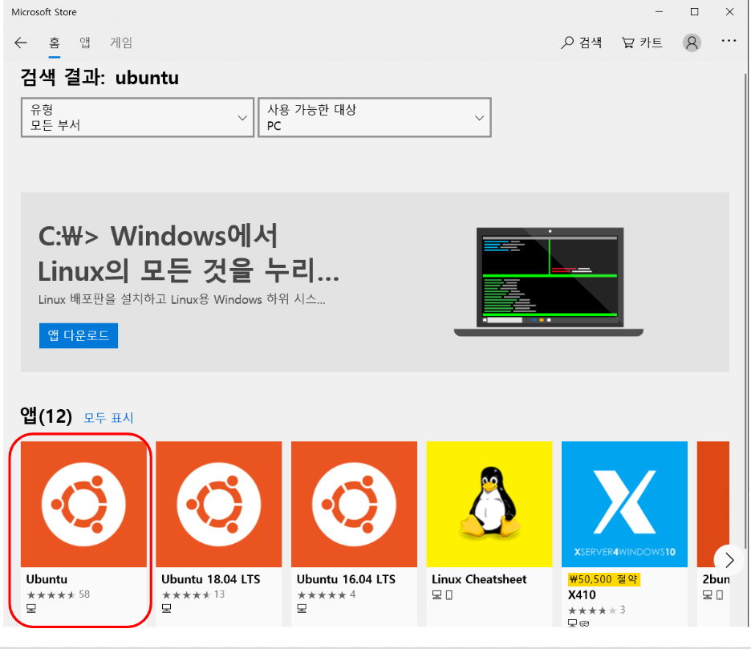

* appwiz.cpl 실행

  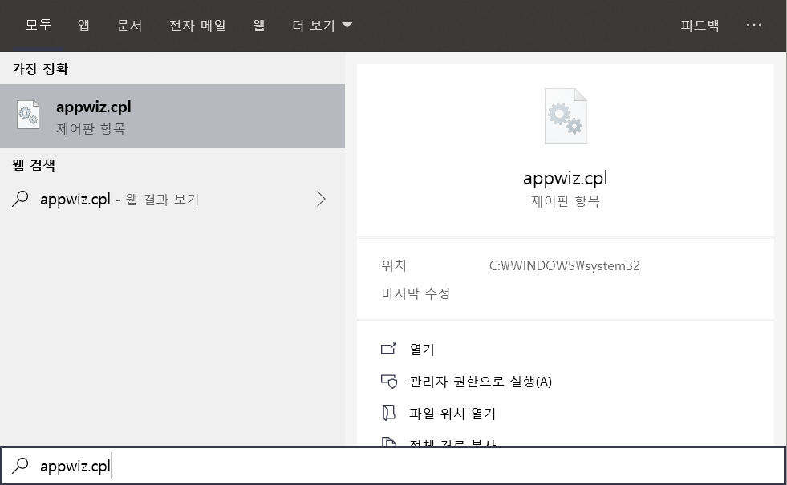

* 프로그램 및 기능에서 windows 기능 켜기/끄기를 통해 Windows Sub System 설치

  * <u>재부팅이 필요하니 부팅전에 저장할 파일들은 모두 저장해주세요\~</u>

  

  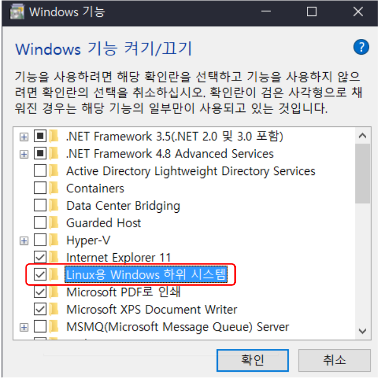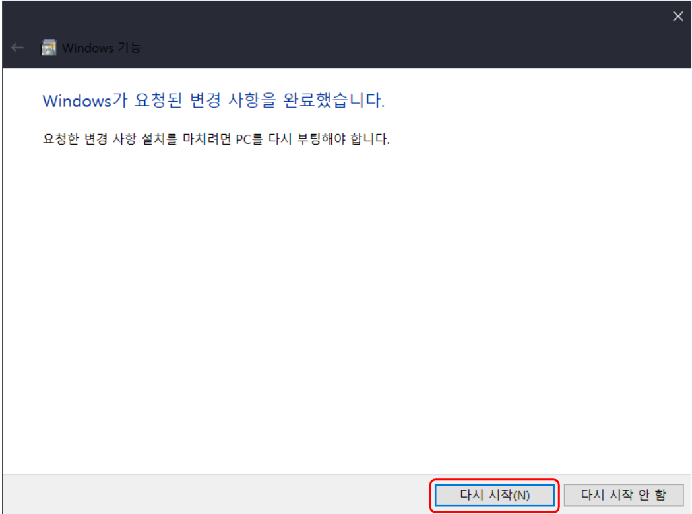

* ubuntu app 실행 및 ID와 Password 설정

  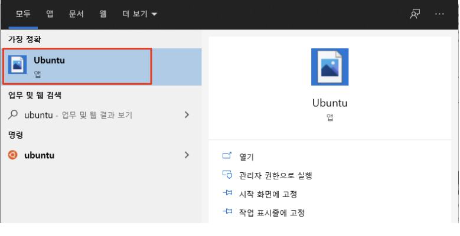

  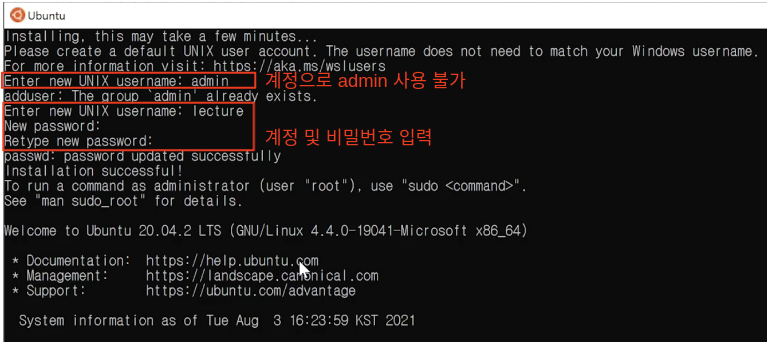

* ubuntu update

  * 다음 명령어를 통해 ubuntu를 업데이트 한다.

  ```bash
  sudo apt-get update && sudo apt-get upgrade -y
  ```
  
  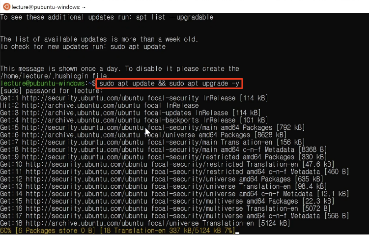


## 컴파일러 설치

* Ubuntu app에서 gcc 컴파일러를 설치한다.

```zsh
sudo apt-get install gcc gdb llvm
```

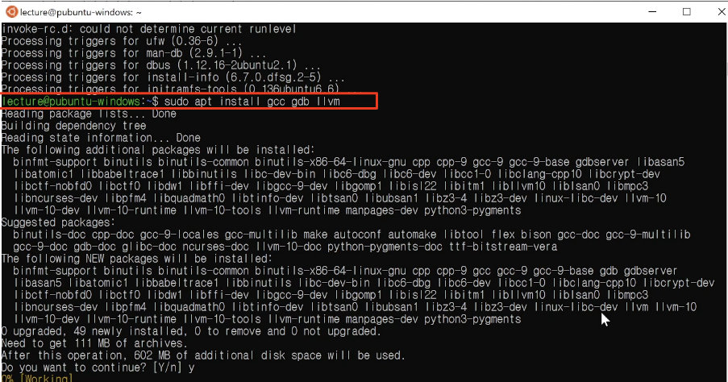


## vscode 설치 및 설정

- vscode는 마이크로소프트에서 제작한 code editor이자 개발도구로 아래의 사이트에서 자세한 사항을 확인할 수 있으며, 다운로드 받을 수 있다. 

  - https://code.visualstudio.com

    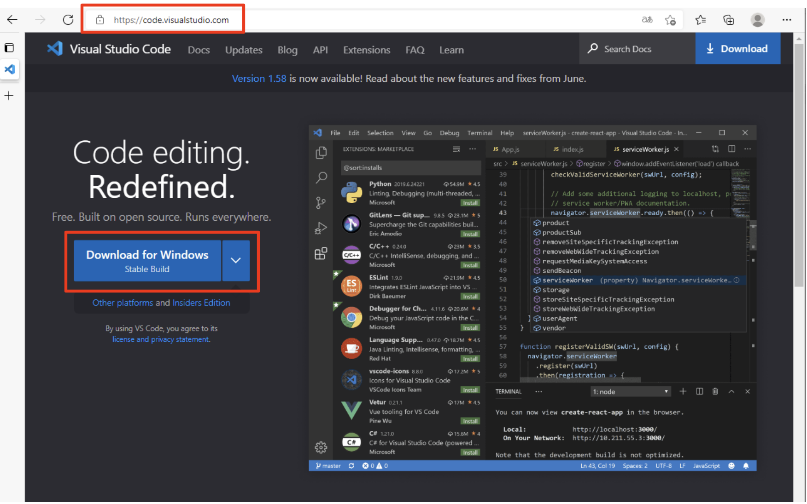

- vscode 설치가 완료되면 c/c++ 개발을 위한 설정을 수행한다. 

  - **plugin 설치** - 다음 2개의 plugin을 설치한다.

    - Remote-WSL

      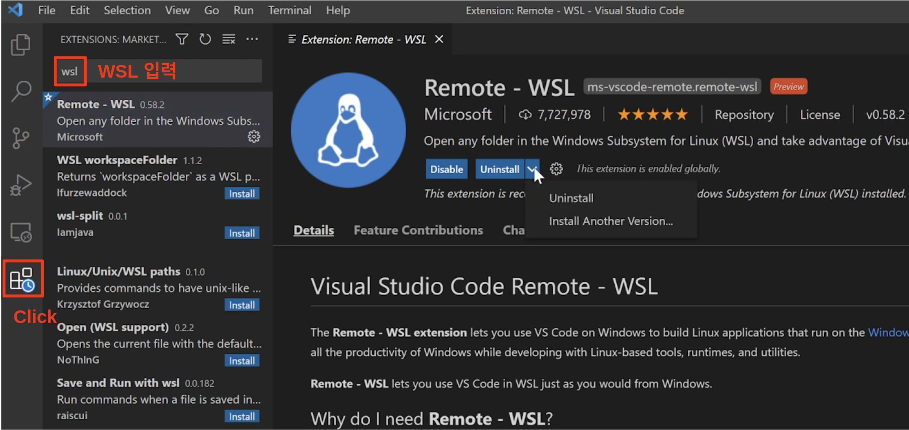

    - c/c++

      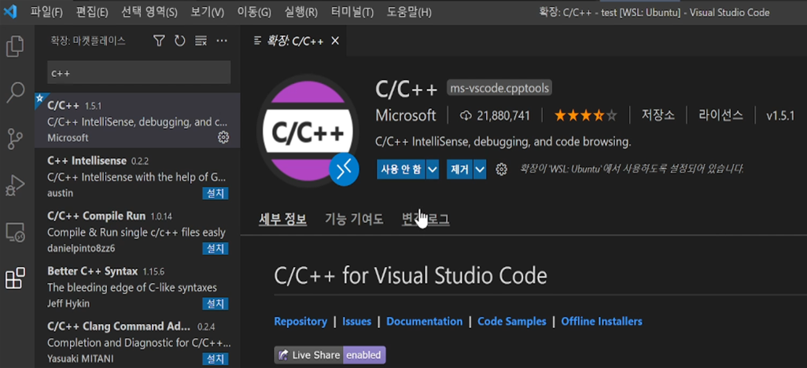

