# 개요

리눅스 환경에서 네트워크 프로그래밍을 위해 우리는 **<u>커널, 컴파일러, 에디터</u>** 3개를 준비해야한다. 


# 커널 준비

리눅스 환경에서 작동하는 프로그램을 만들기 위해서는 네트워크 리눅스 커널을 준비해야한다. 엄밀히 따지면 커널 준비라기 보다는 POSIX 기반 소프트웨어 개발 환경을 준비하는 것이며, mac os 환경을 사용 중이라면 별도의 준비없이 다음 절차로 넘어가도 된다. 

본 절에서는 Windows 사용자를 위해 리눅스 커널을 준비하는 방법에 대해 소개한다. Windows 사용자라면 Windows에서 POSIX기반 소프트웨어를 구동 및 개발할 수 있는 환경을 제공하는 Cygwin을 사용할 수 있지만 우리는 WSL과 Virtual Machine을 사용하는 2가지 방식을 소개한다. 

- [Virtual Machine 을 통해 리눅스 커널 준비하기](./vm/README.md)
  - `.ova` 파일을 통해 리눅스 커널을 준비한 경우 컴파일러 및 에디터를 사전에 준비해놓은 상태이니 아래의 절차를 생략하고 바로 코딩을 하실 수 있습니다.
- [WSL을 통해 리눅스 커널 준비하기](./wsl/README.md)


# 컴파일러 준비

C언어는 대표적인 컴파일 언어이며, gcc, clang과 같은 컴파일러를 준비하여야 한다. 아래의 명령어는 clang 컴파일러를 설치하는 명령어이며, gcc 사용을 원하는 사용자는 아래 명령어에서 clang을 gcc로 대체하여 설치할 수 있다. 일부 운영체제 (우분투 포함) 는 이미 gcc 가 설치되어 있을 수 있다. 

```zsh
sudo apt install clang llvm
```


# 에디터 준비

에디터는 코딩 중 가장 많이 사용하는 도구로, 코딩을 위해서 자신에게 맞는 에디터를 찾는 것도 매우 중요하다. 본 포스트에서는 vim과 vscode 2가지를 이용해 c언어 코딩을 수행하는 방식을 설명하고 있다. 


## vim 설치

vim은 매우 오랜 역사를 가진 에디터로, CLI에서 바로 사용할 수 있기 때문에 SSH를 통해 원격으로 접속하여 코딩을 하고자 하는 사용자에게 매우 적합한 에디터이다. 하지만 GUI 환경에 익숙한 사용자에게는 추천하지 않는다. 

vim 설치는 아래 명령어를 통해 바로 설치할 수 있다. 

```zsh
sudo apt install vim
```


## vscode 설치 및 설정

* vscode는 마이크로소프트에서 제작한 code editor이자 개발도구로 아래의 사이트에서 자세한 사항을 확인할 수 있으며, 다운로드 받을 수도 있다.

  * https://code.visualstudio.com/

* vscode 설치가 완료되면 c/c++ 개발을 위한 설정을 수행한다.

  * plugin 설치 - 다음 2개의 plugin을 설치한다.

    * Remote-WSL

    * c/c++

    

  * plugin 설치가 완료되면 vscode를 재실행 합니다.


## 프로젝트 생성

* project를 생성할 폴더를 생성해준다.

  * ubuntu app을 실행한 후 `mkdir cpp-test` 명령어를 통해 cpp-test 디렉터리를 생성한다.

    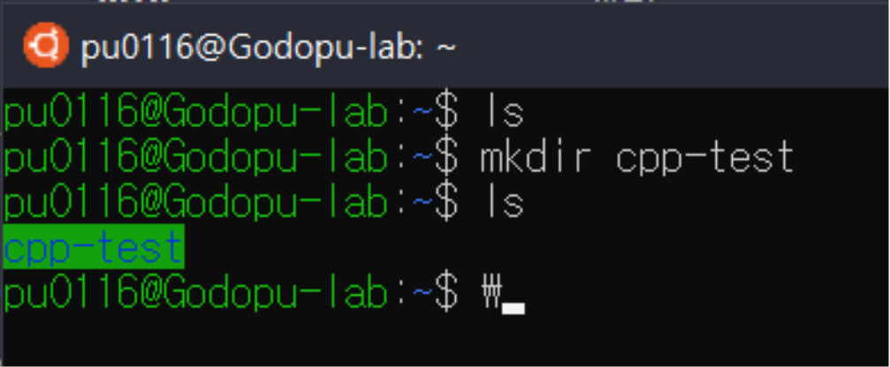

* remote-wsl 플러그인을 사용하여 ubuntu 환경에서 project를 생성해준다.

  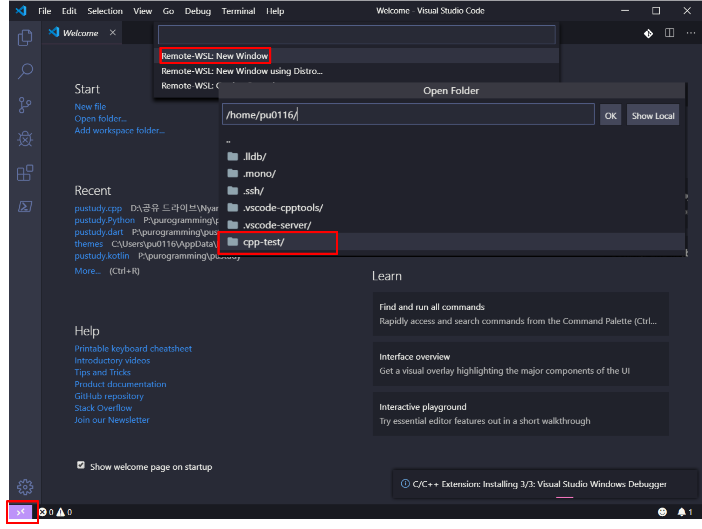

* .gitignore 파일을 생성한 후 .vscode 폴더를 추가한다. (git을 사용하지 않을 사람은 하지 않아도 됨)

  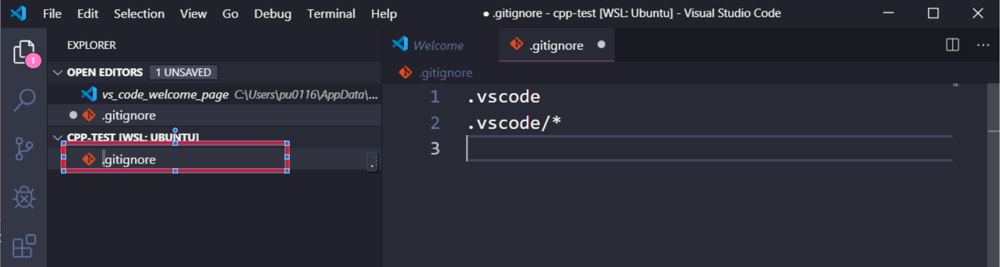

* C++ 작업환경을 구성한다.

  * `Ctrl + Shift + P`를 누른 후 `C/C++: Edit` 을 입력한 후 `C/C++: Edit Configurations` 항목을 선택

    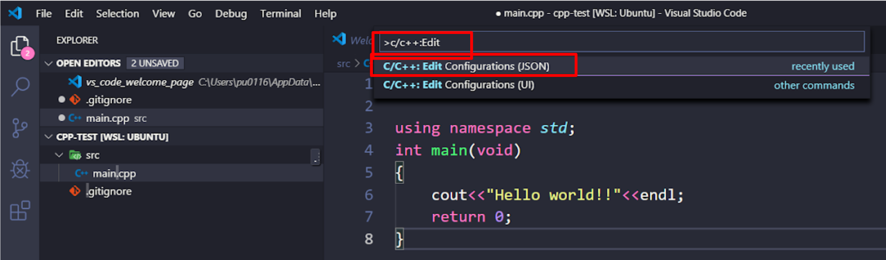

  * .vscode 디렉터리 내에 c_cpp_properties.json 파일이 생성되는 것을 확인한 후 자신이 원하는 환경으로 설정한다.

    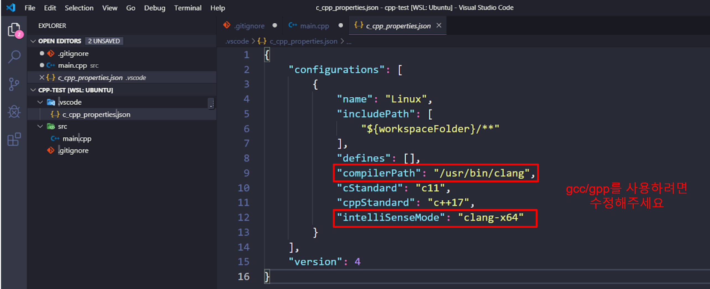

* 소스코드를 작성한다.

  * src 폴더를 생성하고 그 안에 main.cpp 파일을 생성하여 다음 코드를 작성한다.

    ```c++
    #include <iostream>
    
    using namespace std;
    
    int main(void)
    {
        cout << "Hello world!!" << endl;
        return 0;
    }
    
    ```

    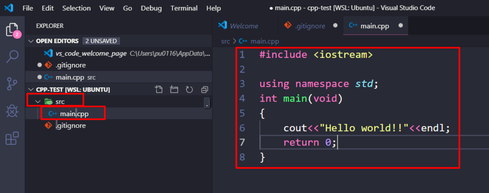

* 빌드

  * 빌드를 위해 Tasks.json파일을 생성한다.

    * 반드시 .cpp 파일을 선택한 후 아래의 절차를 실행할 것!!

    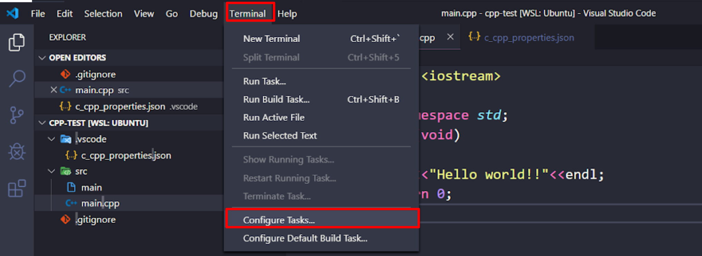****

    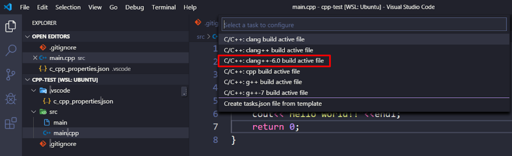

    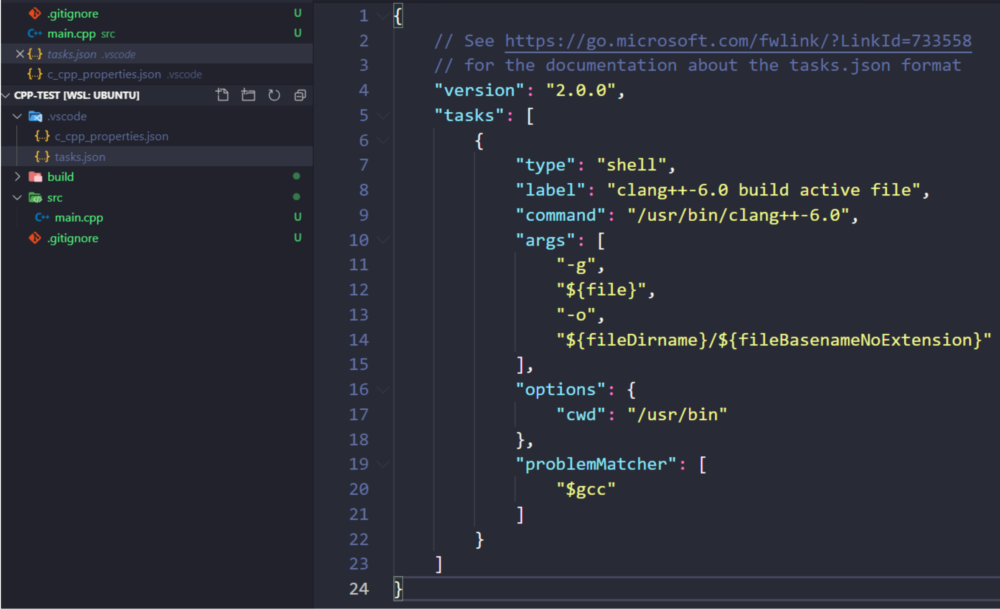

  * 빌드를 수행한다.(<u>Ctrl + Shift + B</u>)

    * Tasks.json 파일은 빌드 방식을 포함하고 있는 파일로 Tasks.json 파일에 여러가지 빌드 방식을 추가할 수 있으며, 다음의 절차로 추가한 빌드 방식 중 1가지를 사용해 빌드를 수행할 수 있다. <u>(Run Build task 하는게 없음)</u>

      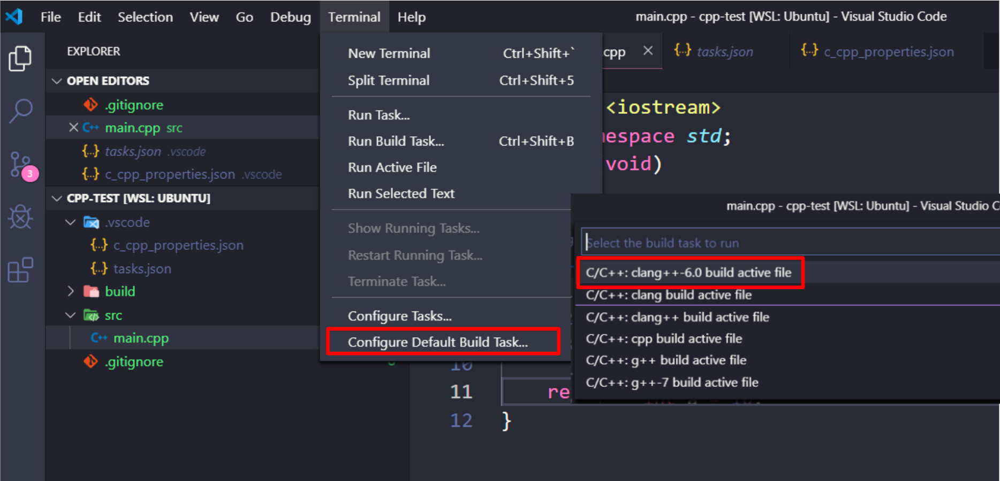

    * main 파일이 생성된 것을 확인한다.

      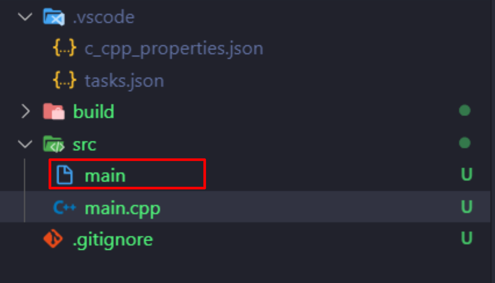

* 디버그

  * 빌드의 방식이 tasks.json 파일에 저장되듯이 디버깅 방식은 launch.json 파일에 저장된다. 다음 절차를 따라하여 launch.json파일을 생성한다.

    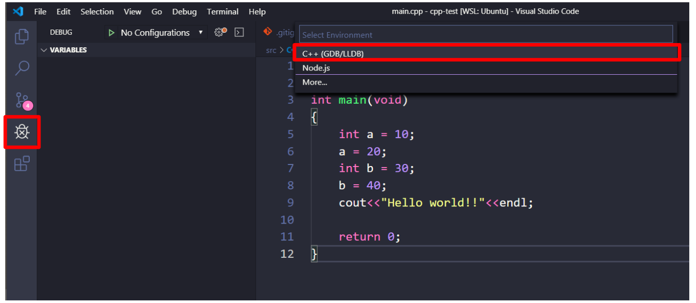

    * Program 속성을 다음과 같이 수정한다.

      `"program" : "${fileDirname}/${fileBasenameNoExtension}"`

    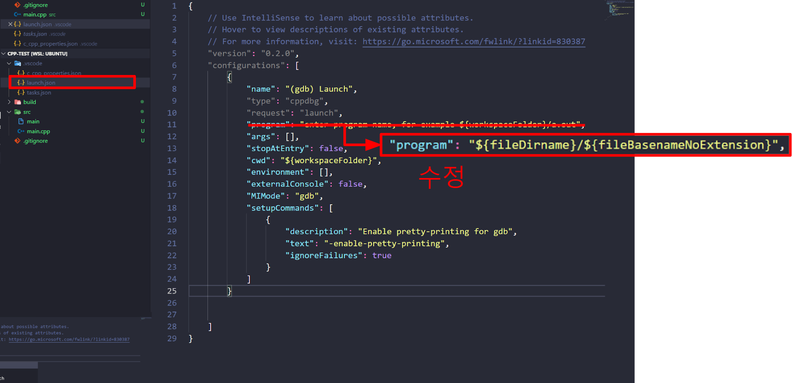

  * F5를 누르면 디버깅이 수행된다.

    * BreakPoint를 찍어 제대로 작동하는지 확인한다.

      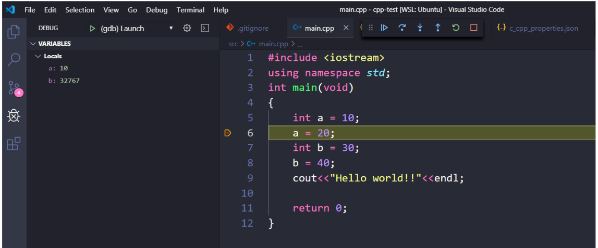


# 실습


# ref

* https://github.com/Microsoft/vscode-cpptools/releases

* https://code.visualstudio.com/docs/cpp/config-wsl

* https://codeday.me/ko/qa/20190627/905798.html

* <https://m.blog.naver.com/PostView.nhn?blogId=stupidus85&logNo=70133129470&proxyReferer=https%3A%2F%2Fwww.google.com%2F>

* <https://pkgpl.org/2014/07/27/sconstruct_basic/>

* <https://clee.tistory.com/88>

* <https://wiki.iotivity.org/build_iotivity_with_ubuntu_build_machine>

* <http://egloos.zum.com/bruceKIM/v/3399880>

* <http://egloos.zum.com/bruceKIM/v/3399880>

* <https://hongku.tistory.com/70>

* <https://scons.org/doc/0.97/HTML/scons-user/x628.html>

