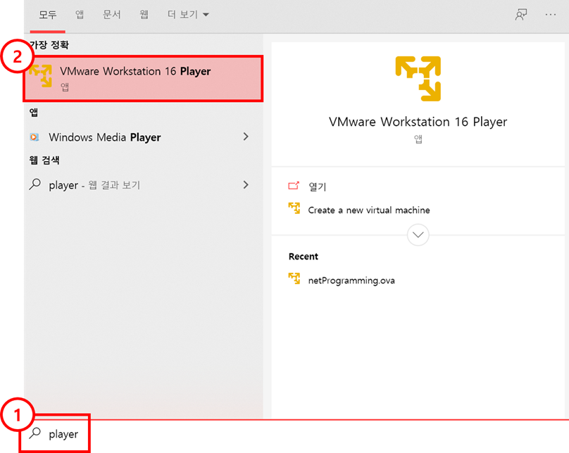
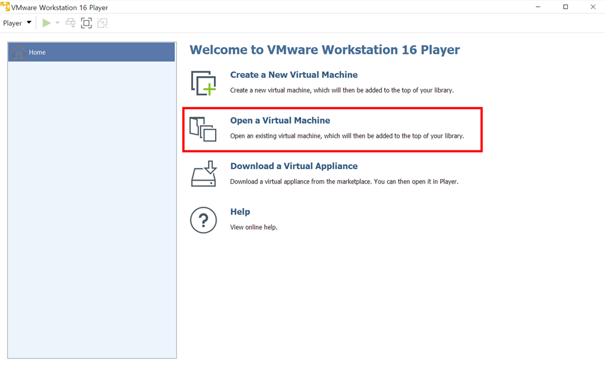
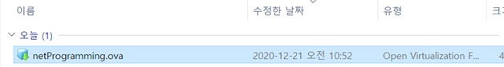
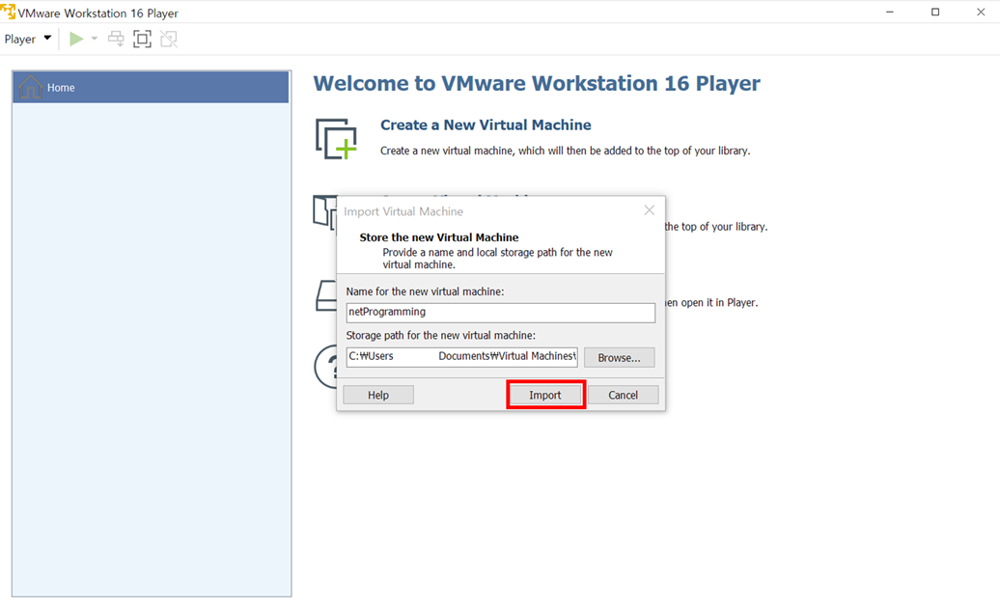
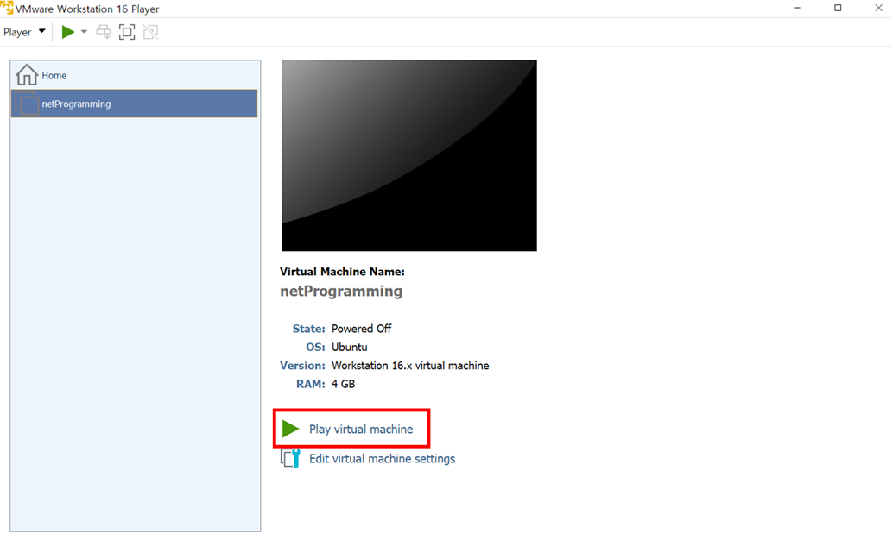
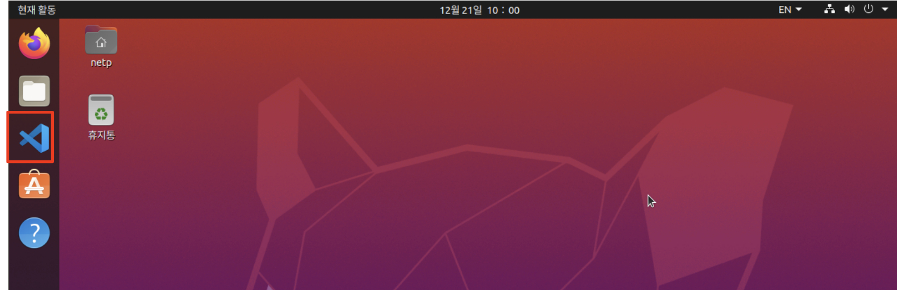

# VMware 설치

Virtual Machine은 다른 운영체제 환경을 구성해야하거나 자원을 분리하기 위해 자주 사용된다. Virtual Machine을 생성하고 실행할 수 있도록 도와주는 프로그램은 매우 다양하지만 해당 포스트에서는 vmware를 통해 vm을 생성하는 방법을 설명한다. vmware는 아래 링크를 통해 설치 파일을 다운로드 할 수 있다. 

[vmware 다운로드](https://www.vmware.com/go/getplayer-win)

# ova 파일 다운로드

OVA 파일은 VMware Workstation 및 Oracle VM Virtualbox와 같은 가상화 응용 프로그램에서 사용되는 가상 어플라이언스이다. OVA 파일은 가상컴퓨터에서 실행되는 소프트웨어를 패키지로 만들고 배포하는데 사용되는 표준형식이다. 본 포스트에서 제공되는 ova 파일을 통해 가상머신을 생성할 경우 컴파일러와 vscode가 설치되어 있는 가상머신이 생성된다.

- [ova 파일 다운로드](https://drive.google.com/file/d/136On8uGjdzVvn94-zPnoxAqfUx_l-31F/view?usp=sharing)

# ova 파일 import

다운로드 한 ova 파일을 VMware Workstation에 import 한다.

- VMware Workstation 16 Player 열기

  - 윈도우 키를 누르고 player를 검색
  - VMware Workstation 16 Player 클릭

  

- VMware Workstation 16 Player가 실행되면 Open a Virtual Machine 클릭

  

- 다운로드 한 .ova 파일 열기

  

  

- virtual machine 실행

  

- 완료

  - ubuntu password : np123!@#
  
  

