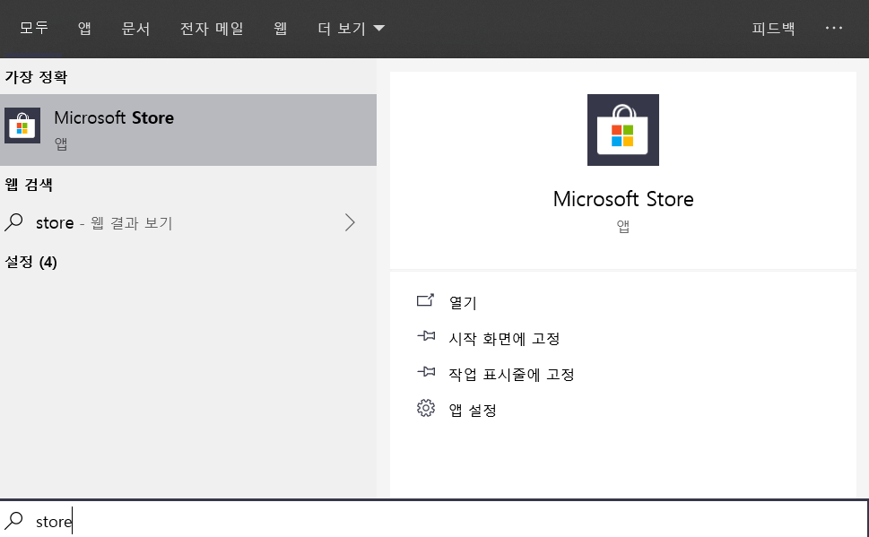
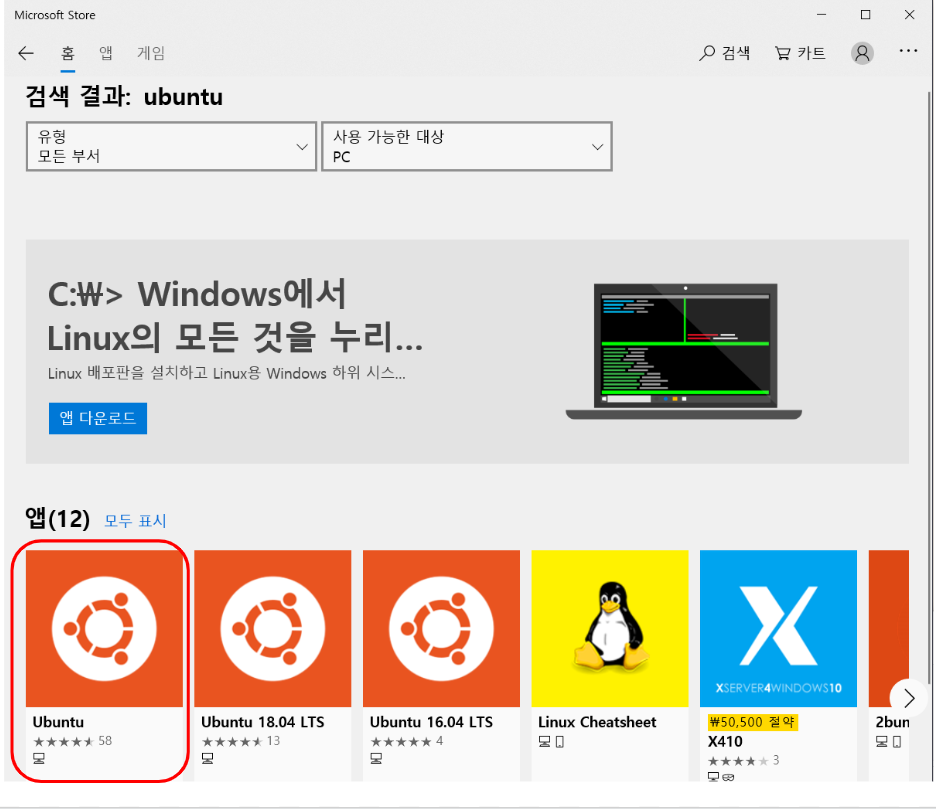
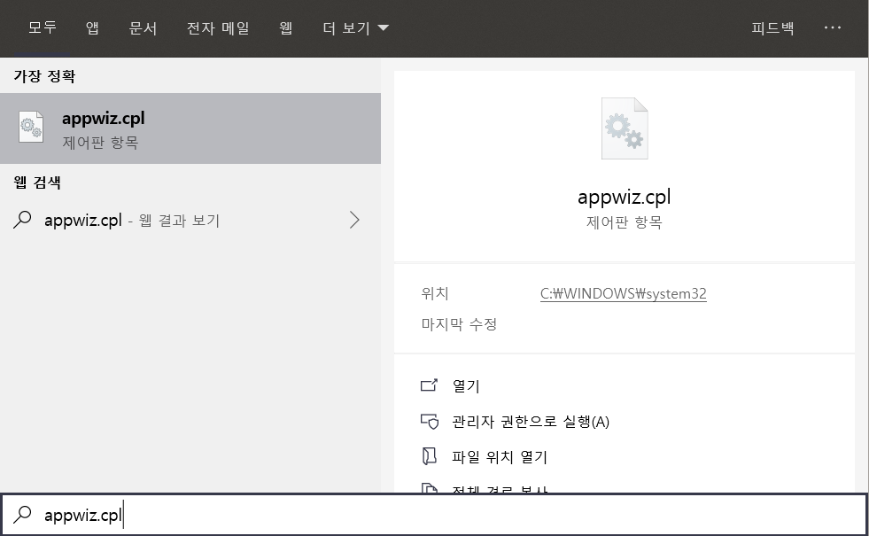
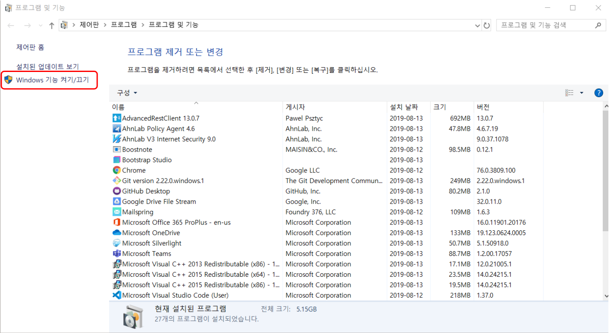
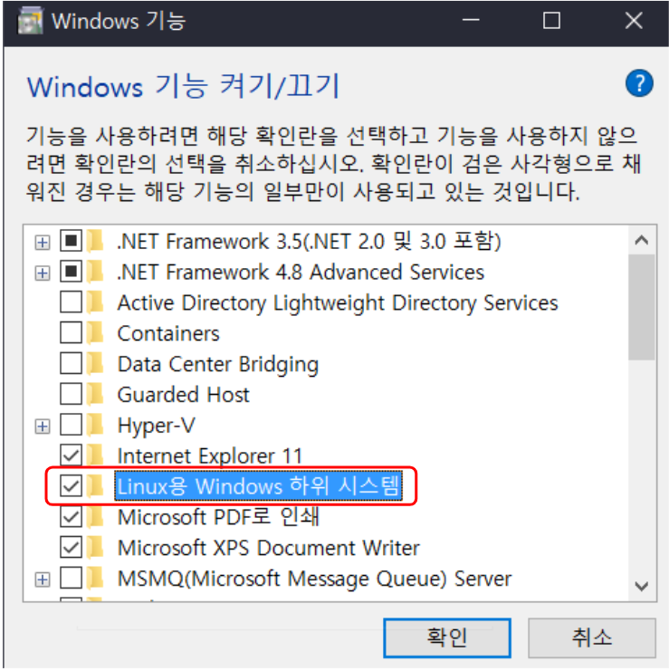
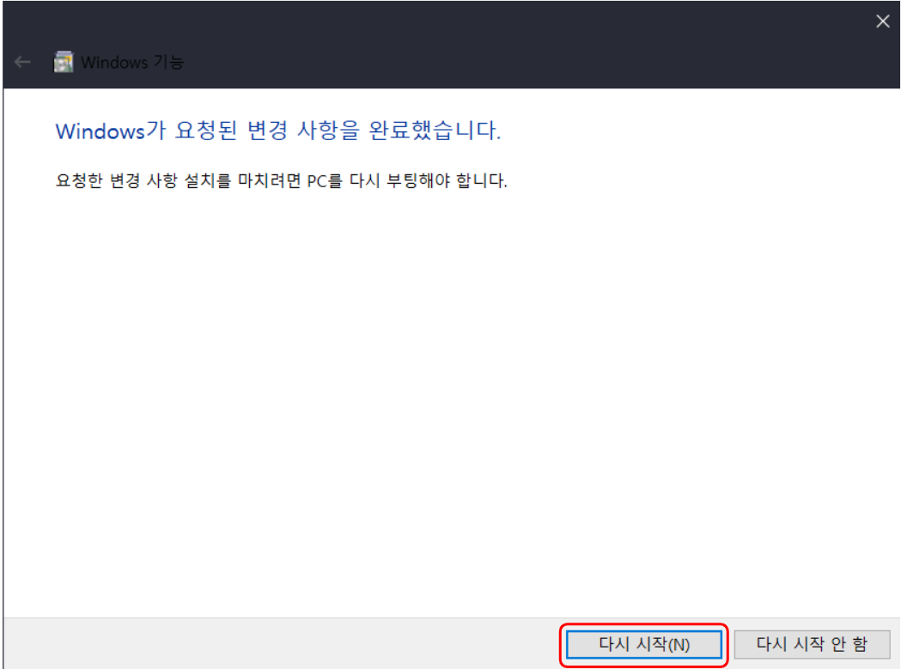
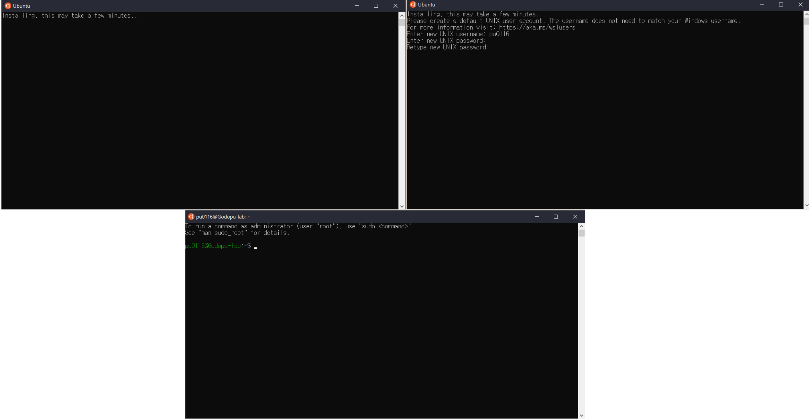

# WSL (Windows Sub System for Linux) 설치
## windows store에서 ubuntu 설치

* windows 키를 누른 후 store 검색

  

* ubuntu app 설치

  

* appwiz.cpl 실행

  

* 프로그램 및 기능에서 wRindows 기능 켜기/

* 끄기를 통해 Windows Sub System 설치

  * <u>재부팅이 필요하니 부팅전에 저장할 파일들은 모두 저장해주세요\~</u>

  

  

* ubuntu app 실행 및 ID와 Password 설정

  

* ubuntu update

  * 다음 명령어를 통해 ubuntu를 업데이트 한다.

  ```bash
  sudo apt-get update
  sudo apt-get upgrade
  ```
